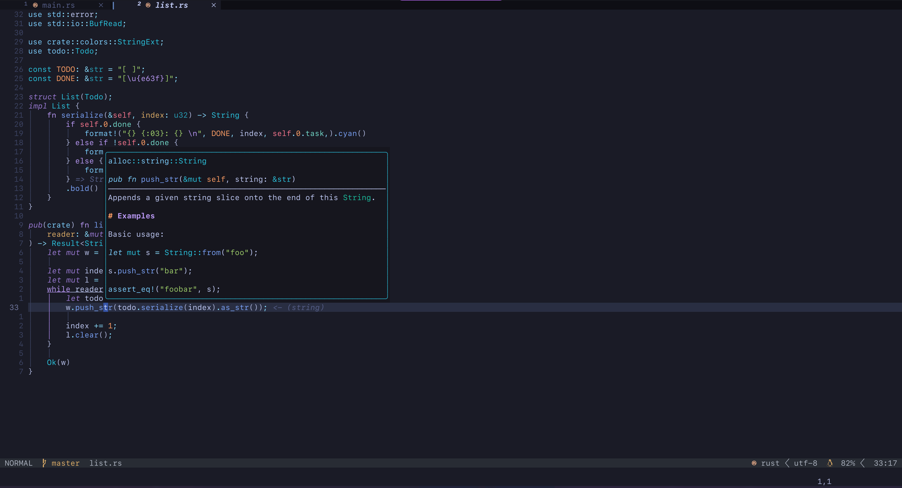

# My Neovim config

## Plugins

- [Autopairs](https://github.com/windwp/nvim-autopairs)
- [Blink.com](https://github.com/Saghen/blink.cmp)
- [Copilot](https://github.com/zbirenbaum/copilot.lua)
- [Fidget](https://github.com/j-hui/fidget.nvim)
- [Gitsigns](https://github.com/lewis6991/gitsigns.nvim)
- [Harpoon](https://github.com/ThePrimeagen/harpoon)
- [Indent blankline](https://github.com/lukas-reineke/indent-blankline.nvim)
- [Lualine](https://github.com/nvim-lualine/lualine.nvim)
- [Mason](https://github.com/williamboman/mason.nvim)
- [Nvim-Tree](https://github.com/nvim-tree/nvim-tree.lua)
- [Oil](https://github.com/stevearc/oil.nvim)
- [Tabout.nvim](https://github.com/abecodes/tabout.nvim)
- [Telescope.nvim](https://github.com/nvim-telescope/telescope.nvim)
- [Todo-comments.nvim](https://github.com/folke/todo-comments.nvim)
- [Treesitter](https://github.com/nvim-treesitter/nvim-treesitter)
- [Trouble.nvim](https://github.com/folke/trouble.nvim)
- [True-Zen](https://github.com/pocco81/true-zen.nvim)
- [Vim fugitive](https://github.com/tpope/vim-fugitive)
- [WhichKey](https://github.com/folke/which-key.nvim)

## Coloring

[TokyoNight](https://github.com/folke/tokyonight.nvim)  
[CyberDream](https://github.com/scottmckendry/cyberdream.nvim)

---

## Vim Tips & Tricks

### normal mode

`Ctrl+y` - to scroll screen up one line (without moving cursor)  
`Ctrl+e` - to scroll screen down one line (without moving cursor)  
`g;` - jump to last edit made  

### Insert mode

`Ctrl+t` - indent line  
`Ctrl+d` - unindent line

### Visual mode

`o,O` - to move to other end of visual selection
